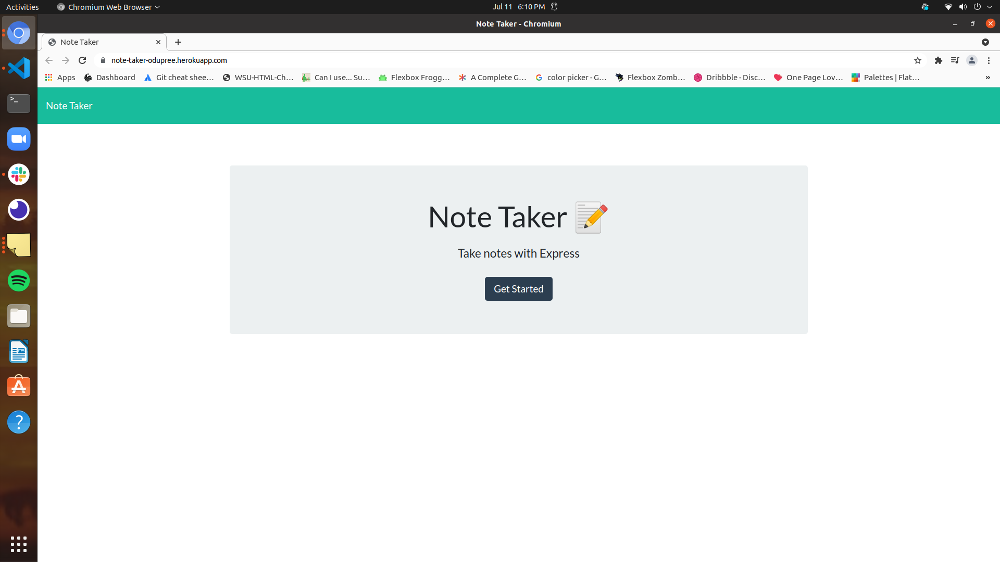
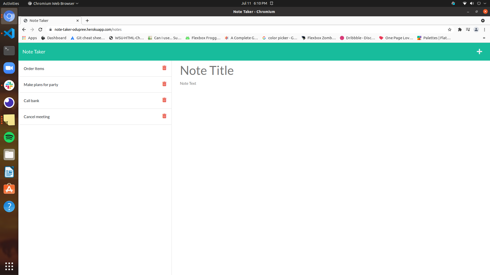

# Note Taker

## Description

An easy to use application for taking and saving notes.

---

## Table of Contents

- [Installation](#installation)
- [Usage](#usage)
- [License](#license)
- [Questions](#questions)

---

## Installation

After cloning the repository, run 'npm init' and 'npm install express'.

---

## Usage

Simply click on the + symbol to create a new note. Once the note has
been created, you can save the note by clicking on the save button on
the top right. You can recall saved notes by clicking the note you would 
like to view. To delete a note, click the trash icon

*Website: https://note-taker-odupree.herokuapp.com/*

---

## License

MIT

Copyright (c) 2021 Owen Dupree

Permission is hereby granted, free of charge, to any person obtaining a copy
of this software and associated documentation files (the "Software"), to deal
in the Software without restriction, including without limitation the rights
to use, copy, modify, merge, publish, distribute, sublicense, and/or sell
copies of the Software, and to permit persons to whom the Software is
furnished to do so, subject to the following conditions:

The above copyright notice and this permission notice shall be included in all
copies or substantial portions of the Software.

---

## Questions

For any questions please contact me directly.

Email: <odupree1988@gmail.com>

GitHub: [odupree1988](https://github.com/odupree1988)

Made By Owen Dupree 2021

---
